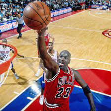

```{r setup1, include=FALSE}
knitr::opts_chunk$set(echo = F)
```


```{r setup2, include=FALSE}
library(flexdashboard)
library(ggplot2)
library(tidyverse)
library(shiny)
library(readxl)
library(broom)
library(knitr)
library(shinyWidgets)
library(ggnewscale)
library(gt)

bball <- read.csv("modern_nba_legends_02242022.csv")

bball <- bball %>%
  select(Name, PTS, AST, TRB, STL) %>%
  drop_na() %>%
  rename(Points = PTS,
         Assists = AST,
         Total_Rebounds = TRB,
         Steals = STL) %>%
  mutate(Name = as.factor(Name)) 


levels(bball$Name) <- list(`Kobe Bryant`  = "KB", `Lebron James` = "LJ", `Michael Jordan` = "MJ")
#got theme from: https://bootswatch.com/
```

Context {data-orientation=rows}
=====================================     

Row {data-height=220}
-------------------------------------

<!-- **Description:** -->
<!-- Introducing statistical concepts with visualizations is vital for students when they are being introduced to new concepts especially when investigating culturally relevant data. A suite using flexdashboard and R shiny to illustrate the mechanism of ANOVA and Simple Linear Regression will be created during this internship which will be used to teach statistical concepts to high school students. -->
<!-- \ -->
<!-- \ -->
**Context - Who is the GOAT?:**
Many NBA (National Basketball Association) fans like to debate who is the GOAT - Greatest of All Time. Most conversations center around Lebron James vs. Michael Jordan, though there are others that should and will be considered. Kobe Bryant had an unmatched work ethic, won more championships than Lebron, and played his whole career with one team. But what really determines who is the best? Is it number of championships won? Or number of points scored? Or assists dished out? This app will help settle this debate - or at least encourage more conversation. 

Row {data-height=350}
-------------------------------------
### Lebron James

```{r LBJ, echo = F, out.width = '85%'}
knitr::include_graphics("download.jpg")
```

### Michael Jordan

```{r MJ, echo = F, out.width = '85%', strip.white=TRUE}

```

### Kobe Bryant

```{r KB, echo = F, out.width = '85%'}

```

Get Hyped! {data-orientation=rows}
=====================================     
**Select "Open in Browser" to watch video**
```{r}
tags$video(
  src = "./hypevideo.mp4",
  type = "video/mp4",
  width = 1280, height = 800,
  controls = "controls"
)
```
Video source:\
YouTube. (2016). Michael Jordan | Kobe Bryant | Lebron James - Clash of the Gods ᴴᴰ. YouTube. https://www.youtube.com/watch?v=HHLdPTxuwGY&amp;t=1s. 


Intro to Variance {data-orientation=rows}
=====================================     

Row {data-height=625}
-------------------------------------
We are going to understand the following equation. We have to breakdown this tool into finer chunks.
$$s^2 = \frac{1}{(n-1)}\sum_{i=1}^n (x_i - \bar{x})^2$$
**Choices:**\
We will investigate the variability of\ 
Points, Total Rebounds, Steals and Assists for the three NBA legends\
(Lebron James, Michael Jordan,and Kobe Bryant) below. All the data is from each player's first\
15 seasons in the NBA; 2003-2018 for Lebron, 1996-2011 for Kobe, and 1984-1999 for Jordan.\
**Definitions:**\
Points: How many points the player scored in that game.\
Assists: How many times that player passed it to a teammate who scored\
in that game.\
Total Rebounds: How many times the player retrieved the ball after a missed shot\
in that game.\
Steals: How many times the player took the ball from the other team in that game.\

### Explanation of Variance

**The Deviation**
$$x_i - \bar{x}$$
**The Squared Deviation**
$$(x_i - \bar{x})^2$$
Why do we square it? We can take the absolute value but it is common practice to square the deviation.

$$ \sum_{i=1}^n (x_i - \bar{x})^2$$

**Variance**
$$s^2 = \frac{1}{(n-1)}\sum_{i=1}^n (x_i - \bar{x})^2$$

**Standard Deviation**
$$s =\sqrt{ \frac{1}{(n-1)}\sum_{i=1}^n (x_i - \bar{x})^2}$$

Row {data-height=575}
-------------------------------------

### Enter Data to Compute Variance
```{r}
tags$style(HTML(".js-irs-0 .irs-single, .js-irs-0 .irs-bar-edge, .js-irs-0 .irs-bar {background: #112446}"))
chooseSliderSkin(skin = "Flat")
sliderInput(inputId = "sample_size", label = "How large do you want your sample?", min = 30, max = 200 ,value = 70, step = 5)

#selecting the sample
bball_mj <- bball %>%
  filter(Name == "Michael Jordan") %>%
  tibble::rowid_to_column("Game_Number")

bball_kb <- bball %>%
  filter(Name == "Kobe Bryant") %>%
  tibble::rowid_to_column("Game_Number")

bball_lj <- bball %>%
  filter(Name == "Lebron James") %>%
  tibble::rowid_to_column("Game_Number")

kb <- reactive({sample_n(bball_kb, input$sample_size)})
lj <- reactive({sample_n(bball_mj, input$sample_size)})
mj <- reactive({sample_n(bball_lj, input$sample_size)})


bball <- reactive(rbind(kb(), lj(), mj()))

selectInput("player", label = "Select a Player", choices = c("Michael Jordan", "Lebron James","Kobe Bryant" ))
selectInput("var", label = "Choose a Variable", choices = c("Points", "Assists", "Total_Rebounds", "Steals"))
newbball <- reactive({filter(bball(), Name == input$player)  %>%
    mutate(Points = as.numeric(Points), 
           Assists = as.numeric(Assists),
           Total_Rebounds = as.numeric(Total_Rebounds),
           Steals = as.numeric(Steals),
           Game_Number = as.numeric(Game_Number)
    ) 
})
```   

### Variance Visual - Horizontal Line is the Mean, Vertical Lines are the Deviations

```{r}
#getting the game number that the stats came from
index <- reactive({index = as.numeric(row.names(newbball()))})

#getting mean for a specific player and variable
mean_var = reactive({
  var <- input$var
  if (var =="Points"){
    mean(newbball()$Points)
  }
  else if (var == "Assists"){
    mean(newbball()$Assists)
  }
  else if (var == "Total_Rebounds"){
    mean(newbball()$Total_Rebounds)
  }
  else{
    mean(newbball()$Steals)
  }
})

#getting variance for a specific player and variable
variance_var = reactive({
  var <- input$var
  if (var =="Points"){
    var(newbball()$Points)
  }
  else if (var == "Assists"){
    var(newbball()$Assists)
  }
  else if (var == "Total_Rebounds"){
    var(newbball()$Total_Rebounds)
  }
  else{
    var(newbball()$Steals)
  }
})

#changing the line colors based on player
color_lines = reactive({
  player <- input$player
  if (player == "Kobe Bryant"){
    "purple"
  }
  else{
    "red"
  }
})

#changing the main line color based on player
color_main = reactive({
  player <- input$player
  if (player == "Michael Jordan"){
    "gray8"
  }
  else{
    "goldenrod1"
  }
})

renderPlot({
  ggplot(newbball(), aes_string(x = "Game_Number" , y = input$var)) +
    geom_point() +
    labs(x = "Game Number") +
    stat_summary(fun.y = mean, aes(x = 1, yintercept =..y.. ), geom = "hline", 
                 col = color_main(), size = 1.25) +
    ggtitle(paste(input$player, input$var,
                  "- Mean is:", round(mean_var(), 2),
                  ", Variance is:", round(variance_var(), 2) )) +
    theme_bw() +
    geom_segment(aes_string(x = "Game_Number", 
                            xend = "Game_Number", 
                            y = input$var, 
                            yend = mean_var()),
                 colour = color_lines())
})
```

Intro to ANOVA: Sum of Squares {data-orientation=rows}
=====================================     

Row {data-height=150}
-------------------------------------
When discussing variance in terms of groups, there are three types that we want to focus on. These are between group variation, within group variation and total variation. 
We can begin, as with variance, by breaking down each type.
Note: i is used for each individual observation, and j for each group. For example, $\bar{x}_2$ is the mean of group 2, and $x_{23}$ is the the third observation in group 2. $\bar{Y}$ is the overall mean, across all groups. We use *n* to denote the number of observations in our sample, and *k* to denote the number of groups. 
The quantity we get at the end is called our Sum of Squares. 

Row {data-height=700}
-------------------------------------

### Within Group Variance (Error)

**The Deviation**
$$y_{ij} - \bar{y}_j$$
Notice this deviation is a bit different, as it is the deviation of each observation in a group from its corresponding group mean.

**The Squared Deviation**
$$(y_{ij} - \bar{y}_j)^2$$

Why do we square it? We can take the absolute value but it is common practice to square the deviation.


**Sum of Squares Within Groups**
$$ \sum_{j=1}^k\sum_{i=1}^n (y_{ij} - \bar{y}_j)^2$$
Notice we are summing this quantity twice. First, we calculate the squared deviation for each group, which we saw before. Then we are adding all of the squared deviations across all the groups. Notice we only add up to k for our second summation, as we have k groups, while we add up to n in our first summation as we have n observations in each group. 

This gives us the Sum of Squares Within Groups or Sum of Squares Error (SSE).

### Between Group Variance

**The Deviation**
$$\bar{y_j} - \bar{Y}$$
Notice this deviation is a bit different, as it is the deviation of the group means from the overall mean. 

**The Squared Deviation**
$$(\bar{y_j} - \bar{Y})^2$$
**Sum of Squares Between Groups**
$$\sum_{j=1}^n n_j*(\bar{y_j} - \bar{Y})^2$$
Now notice we multiply by the size of each group ($n_j$). This is to account for some groups not being the same size, so we weight our quantity. We give more weight to bigger groups, and less weight to smaller groups. 

This gives us Sum of Squares Between Groups.

### Total Variance

**The Deviation**
$$y_{ij} - \bar{Y}$$
Notice this deviation is a bit different, as it is the deviation of each observation from the overall mean. 

**The Squared Deviation**
$$(y_{ij} - \bar{Y})^2$$


**Sum of Squares Total**
$$\sum_{j=1}^k\sum_{i=1}^n(y_{ij} - \bar{Y})^2$$
Notice we are summing this quantity twice. First, we calculate the squared deviation from the overall mean for each group, similar to what we saw before. Then we are adding all of the squared deviations across all the groups. Notice we only add up to k for our second summation, as we have k groups, while we add up to n in our first summation as we have n observations in each group. 

This gives us the Sum of Squares Total or Sum of Squares Error (SST). Note that Sum of Squares Between + Sum of Squares Within  = Sum of Squares Total.

Intro to ANOVA: Mean Square & F {data-orientation=rows}
=====================================     
Row {data-height=150}
-------------------------------------
Now that we have learned how to calculate Sum of Squares, or SS, we can now learn about Mean Squares and F. Each Sum of Squares has a corresponding Mean Square, so we will have three in total. However, we only really care about Mean Square Within and Mean Square Between.
Before we can calculate Mean Squares, we need to learn about **degrees of freedom**.

Row {data-height=700}
-------------------------------------
### Degrees of Freedom
You may have encountered degrees of freedom with other statistics, such as the t-statistic. If not, no worries! It is not a prerequisite to learning this topic.
\
\
Degrees of freedom can be understood most simply by example. Let's say we have a dataset with a mean of 5, and we have 4 values. We know 3 of the values are 4, 4, 6. Therefore, the last value must be 6, since we know our mean is 5. The degrees of freedom here is 3, since we only need to know 3 numbers of our dataset.

Keeping that example in mind, here are the formulas for degrees of freedom. Remember that *n* is our total sample size, and *k* is our number of groups. 

Between degrees of freedom (df): *k-1*\
Within degrees of freedom (df): *n-k*\
Total degrees of freedom (df): *n-1*

Notice that\
Between df + Within df = \
*k-1 + n- k * =\
*n-1* = \
Total df


### Mean Square
Now that we know about degrees of freedom, we can calculate our Mean Squares. The general formula will be $$\frac{SS}{df}$$

Applying that gives us:
Mean Square Between: $$MSB = \frac{SSBetween}{k-1} = \frac{\sum_{j=1}^n n_j*(\bar{y_j} - \bar{Y})^2}{k-1}$$

Mean Square Within (or Mean Square Error): 
$$MSW = \frac{SSWithin}{n-k}$$ = $$\frac{\sum_{j=1}^k\sum_{i=1}^n (y_{ij} - \bar{y}_j)^2}{n-k}$$

### F Statistic
Finally, we can ask, is our result significant? Is at least one group mean different from the rest? We can answer this with the **f-statistic** or f-ratio.

This is calculated with a ratio, as the name suggests, with pieces we have already calculated. This ratio compares within and between group variation, as we have been focusing on.

The formula is $$f = \frac{MSB}{MSW}$$

We can get a p-value from this f-statistic, which comes from an f-distribution with (between_df, within_df) degrees of freedom. Yes, this statistic has TWO degrees of freedom!


Analysis of Variance {data-orientation=rows}
=====================================     

Row {data-height=200}
-------------------------------------
**Context**\
Now that we have a grasp on what variability is, we will dive into Analysis of Variance (ANOVA). We will be using the same data as previous, but comparing all three players at once. Now, we can see which player does better at what. For example, who scored more, on average, within their first 15 seasons? 
To make this comparison, we will use ANOVA. This is a procedure which takes multiple groups/categories (here, each player) and compares their means. However, it is not as simple as seeing which mean is biggest or smallest. ANOVA, as the name suggests, focuses on variance. In the first panel, we looked at variance within each player. Now we will add in the variance between the players. 

Row {data-height=700}
-------------------------------------

### Choosing Variable for ANOVA

```{r}
selectInput("graph", "Choose a graph to view:", 
            choices = c("Dotplot", "Boxplot", "Violin Plot"))

selectInput("var_anova", label = "Choose a Variable", choices = c("Points", "Assists", "Total_Rebounds", "Steals"))

selectInput("output", "Choose an output to view:", 
            choices = c("ANOVA", "Linear Regression", "Summary Statistics"))

checkboxInput("playmean", "Add Each Player's Mean", FALSE)
checkboxInput("jitter", "Add Individual Observations", FALSE)
checkboxInput("total_mean", "Add Overall Mean", FALSE)

anova_output <- reactive({tidy(aov(bball()[[input$var_anova]] ~ Name, data = bball()))})
reg_output <- reactive({tidy(lm(bball()[[input$var_anova]] ~ Name, data = bball()))})


my_var_anova = reactive({
  var <- input$var_anova
  if (var =="Points"){
    df <- bball() %>%
      select(Points, Name)
    
    rename(df, Variable = Points)
  }
  else if (var == "Assists"){
    df <- bball() %>%
      select(Assists, Name)
    
    rename(df, Variable = Assists)
  }
  else if (var == "Total_Rebounds"){
    df <- bball() %>%
      select(Total_Rebounds, Name)
    
    rename(df, Variable = Total_Rebounds)
  }
  else{
    df <- bball() %>%
      select(Steals, Name)
    rename(df, Variable = Steals)
  }
})

summary_stats <- reactive({
  my_var_anova() %>%
    group_by(Name) %>%
    summarize(Games = n(), `Mean` = round(mean(Variable), digits = 2), `Median` = round(median(Variable), digits = 2), `SD` = round(sd(Variable), digits = 2)) %>%
    tibble() %>%
    gt()
})


output_choice <- reactive({
  choice <- input$output
  if (choice == "ANOVA"){
    anova_output()
  }
  else if (choice == "Linear Regression"){
    reg_output()
  }
  else {
    summary_stats()
  }
})

renderTable(output_choice())

```   

### ANOVA

```{r}
#getting mean for a variable
mean_var_anova = reactive({
  var <- input$var_anova
  if (var =="Points"){
    mean(bball()$Points)
  }
  else if (var == "Assists"){
    mean(bball()$Assists)
  }
  else if (var == "Total_Rebounds"){
    mean(bball()$Total_Rebounds)
  }
  else{
    mean(bball()$Steals)
  }
})


plot1 <-reactive({
  playmean <- input$playmean
  total_mean <- input$total_mean 
  
  if(playmean == TRUE & total_mean == TRUE){
    ggplot(bball(), aes_string(x="Name", y=input$var_anova, color = "Name")) +
      geom_point() + scale_color_manual(values = c("Kobe Bryant" = "purple","Michael Jordan"= "red","Lebron James"=" goldenrod")) + theme_bw() +  theme(axis.title = element_text(size = 16), plot.title = element_text(size = 18), axis.text.x = element_text(size = 14), legend.title = element_text(size = 16), legend.text = element_text(size =12), axis.text.y = element_text(size = 14)) + new_scale_color() + geom_line(aes(x = Name, y = mean_var_anova(), group = 1, color = "gray0"), size = 1.5) + stat_summary(fun = mean, geom = "errorbar", aes(ymax = ..y.., ymin =..y.., color = Name), width = 0.75, size = 1, linetype = "dashed") + scale_color_manual(values = c("Overall" = "gray0", "Kobe Bryant" = "purple","Michael Jordan"= "red","Lebron James"=" goldenrod"), name = "Legend for Means") 
  }
  else if(playmean == TRUE & total_mean == FALSE){
    ggplot(bball(), aes_string(x="Name", y=input$var_anova, color = "Name")) +
      geom_point() + scale_color_manual(values = c("Kobe Bryant" = "purple","Michael Jordan"= "red","Lebron James"=" goldenrod")) + theme_bw() +  theme(axis.title = element_text(size = 16), plot.title = element_text(size = 18), axis.text.x = element_text(size = 14), legend.title = element_text(size = 16), legend.text = element_text(size =12), axis.text.y = element_text(size = 14)) + new_scale_color() + stat_summary(fun = mean, geom = "errorbar", aes(ymax = ..y.., ymin =..y.., color = Name), width = 0.75, size = 1, linetype = "dashed") + scale_color_manual(values = c("Kobe Bryant" = "purple","Michael Jordan"= "red","Lebron James"=" goldenrod"), name = "Legend for Means") 
  }
  
  else if(playmean == FALSE & total_mean == TRUE){
    ggplot(bball(), aes_string(x="Name", y=input$var_anova, color = "Name")) +
      geom_point() + scale_color_manual(values = c("Kobe Bryant" = "purple","Michael Jordan"= "red","Lebron James"=" goldenrod")) + theme_bw() +  theme(axis.title = element_text(size = 16), plot.title = element_text(size = 18), axis.text.x = element_text(size = 14), legend.title = element_text(size = 16), legend.text = element_text(size =12), axis.text.y = element_text(size = 14)) + new_scale_color() + geom_line(aes(x = Name, y = mean_var_anova(), group = 1, color = "gray0"), size = 1.5)  + scale_color_manual(values = c("Overall" = "gray0"), name = "Legend for Means")
  }
  
  else{
    ggplot(bball(), aes_string(x="Name", y=input$var_anova, color = "Name")) +
      geom_point() + scale_color_manual(values = c("Kobe Bryant" = "purple","Michael Jordan"= "red","Lebron James"=" goldenrod")) + theme_bw() +  theme(axis.title = element_text(size = 16), plot.title = element_text(size = 18), axis.text.x = element_text(size = 14), legend.title = element_text(size = 16), legend.text = element_text(size =12), axis.text.y = element_text(size = 14)) 
  }
  
})

plot2 <- reactive({
  jitter <- input$jitter
  playmean <- input$playmean
  total_mean <- input$total_mean
  
  if(playmean == TRUE & jitter == TRUE){
    if(total_mean == TRUE){
      ggplot(bball(), aes_string(x="Name", y=input$var_anova, fill = "Name")) + geom_boxplot(alpha = 0.4) + scale_fill_manual(values =    c("Kobe Bryant" = "purple","Michael Jordan"= "red","Lebron James"=" goldenrod")) + theme_bw() + geom_jitter(width = 0.1, aes(colour = Name)) +
        scale_color_manual(values = c("Kobe Bryant" = "purple","Michael Jordan"= "red","Lebron James"=" goldenrod")) +  theme(axis.title = element_text(size = 16), plot.title = element_text(size = 18), axis.text.x = element_text(size = 14), legend.title = element_text(size = 16), legend.text = element_text(size =12), axis.text.y = element_text(size = 14)) + new_scale_color() + geom_line(aes(x = Name, y = mean_var_anova(), group = 1, color = "gray0"), linetype = "longdash", size = 2)  + scale_color_manual(values = c("Overall" = "gray0", "Kobe Bryant" = "purple","Michael Jordan"= "red","Lebron James"=" goldenrod"), name = "Legend for Means") +   stat_summary(fun = mean, geom = "errorbar", aes(ymax = ..y.., ymin =..y.., color = Name), width = 0.75, size = 1, linetype =  "dashed")
    }
    
    else{
      ggplot(bball(), aes_string(x="Name", y=input$var_anova, fill = "Name")) + geom_boxplot(alpha = 0.4) + scale_fill_manual(values =    c("Kobe Bryant" = "purple","Michael Jordan"= "red","Lebron James"=" goldenrod")) + theme_bw() + geom_jitter(width = 0.1, aes(colour = Name)) +
        scale_color_manual(values = c("Kobe Bryant" = "purple","Michael Jordan"= "red","Lebron James"=" goldenrod")) +  theme(axis.title = element_text(size = 16), plot.title = element_text(size = 18), axis.text.x = element_text(size = 14), legend.title = element_text(size = 16), legend.text = element_text(size =12), axis.text.y = element_text(size = 14)) + new_scale_color()  + scale_color_manual(values = c("Kobe Bryant" = "purple","Michael Jordan"= "red","Lebron James"=" goldenrod"), name = "Legend for Means") +   stat_summary(fun = mean, geom = "errorbar", aes(ymax = ..y.., ymin =..y.., color = Name), width = 0.75, size = 1, linetype =  "dashed")
    }
    
  }
  else if(playmean == TRUE & jitter == FALSE){
    if(total_mean == TRUE){
      ggplot(bball(), aes_string(x="Name", y=input$var_anova, fill = "Name")) + geom_boxplot(alpha = 0.4) + scale_fill_manual(values =    c("Kobe Bryant" = "purple","Michael Jordan"= "red","Lebron James"=" goldenrod")) + theme_bw() +
        scale_color_manual(values = c("Kobe Bryant" = "purple","Michael Jordan"= "red","Lebron James"=" goldenrod"))  + new_scale_color() + 
        geom_line(aes(x = Name, y = mean_var_anova(), group = 1, color = "gray0"), linetype = "longdash", size = 2) +  theme(axis.title = element_text(size = 16), plot.title = element_text(size = 18), axis.text.x = element_text(size = 14), legend.title = element_text(size = 16), legend.text = element_text(size =12), axis.text.y = element_text(size = 14)) + scale_color_manual(values = c("Overall" = "gray0", "Kobe Bryant" = "purple","Michael Jordan"= "red","Lebron James"=" goldenrod"), name = "Legend for Means") + stat_summary(fun = mean, geom = "errorbar", aes(ymax = ..y.., ymin =..y.., color = Name), width = 0.75, size = 1, linetype =  "dashed")
    }
    else{
      ggplot(bball(), aes_string(x="Name", y=input$var_anova, fill = "Name")) + geom_boxplot(alpha = 0.4) + scale_fill_manual(values =    c("Kobe Bryant" = "purple","Michael Jordan"= "red","Lebron James"=" goldenrod")) + theme_bw() +
        stat_summary(fun = mean, geom = "errorbar", aes(ymax = ..y.., ymin =..y.., color = Name), width = 0.75, size = 1, linetype =      "dashed") + scale_color_manual(values = c("Kobe Bryant" = "purple","Michael Jordan"= "red","Lebron James"=" goldenrod")) +  theme(axis.title = element_text(size = 16), plot.title = element_text(size = 18), axis.text.x = element_text(size = 14), legend.title = element_text(size = 16), legend.text = element_text(size =12), axis.text.y = element_text(size = 14)) + new_scale_color() + scale_color_manual(values = c("Kobe Bryant" = "purple","Michael Jordan"= "red","Lebron James"=" goldenrod"), name = "Legend for Means") +   stat_summary(fun = mean, geom = "errorbar", aes(ymax = ..y.., ymin =..y.., color = Name), width = 0.75, size = 1, linetype =  "dashed")
    }
  }
  else if(playmean == FALSE & jitter == TRUE){
    if(total_mean == TRUE){
      ggplot(bball(), aes_string(x="Name", y=input$var_anova, fill = "Name")) + geom_boxplot(alpha = 0.4) + scale_fill_manual(values = c("Kobe Bryant" = "purple","Michael Jordan"= "red","Lebron James"=" goldenrod")) + theme_bw() + geom_jitter(width = 0.1, aes(colour = Name)) + scale_color_manual(values = c("Kobe Bryant" = "purple","Michael Jordan"= "red","Lebron James"=" goldenrod")) +  new_scale_color() + geom_line(aes(x = Name, y = mean_var_anova(), group = 1, color = "gray0"), linetype = "longdash", size = 2) +  theme(axis.title = element_text(size = 16), plot.title = element_text(size = 18), axis.text.x = element_text(size = 14), legend.title = element_text(size = 16), legend.text = element_text(size =12), axis.text.y = element_text(size = 14)) + scale_color_manual(values = c("Overall Mean" = "gray0"), name = "Legend for Means") 
    }
    else{
      ggplot(bball(), aes_string(x="Name", y=input$var_anova, fill = "Name")) + geom_boxplot(alpha = 0.4) + scale_fill_manual(values =    c("Kobe Bryant" = "purple","Michael Jordan"= "red","Lebron James"=" goldenrod")) + theme_bw() + geom_jitter(width = 0.1, aes(colour = Name))  + scale_color_manual(values = c("Kobe Bryant" = "purple","Michael Jordan"= "red","Lebron James"=" goldenrod")) +  theme(axis.title = element_text(size = 16), plot.title = element_text(size = 18), axis.text.x = element_text(size = 14), legend.title = element_text(size = 16), legend.text = element_text(size =12), axis.text.y = element_text(size = 14))
    }
  }
  else{
    if(total_mean == TRUE){
      ggplot(bball(), aes_string(x="Name", y=input$var_anova, fill = "Name")) + geom_boxplot(alpha = 0.4) + scale_fill_manual(values =    c("Kobe Bryant" = "purple","Michael Jordan"= "red","Lebron James"=" goldenrod")) + theme_bw() +  new_scale_color()  + geom_line(aes(x = Name, y = mean_var_anova(), group = 1, color = "gray0"), linetype = "longdash", size = 2) +  theme(axis.title = element_text(size = 16), plot.title = element_text(size = 18), axis.text.x = element_text(size = 14), legend.title = element_text(size = 16), legend.text = element_text(size =12), axis.text.y = element_text(size = 14)) + scale_color_manual(values = c("Overall Mean" = "gray0"), name = "Legend for Means")
    }
    else{
      ggplot(bball(), aes_string(x="Name", y=input$var_anova, fill = "Name")) + geom_boxplot(alpha = 0.4) + scale_fill_manual(values =    c("Kobe Bryant" = "purple","Michael Jordan"= "red","Lebron James"=" goldenrod")) + theme_bw() +  theme(axis.title = element_text(size = 16), plot.title = element_text(size = 18), axis.text.x = element_text(size = 14), legend.title = element_text(size = 16), legend.text = element_text(size =12), axis.text.y = element_text(size = 14))
    }
  }
})

plot3 <- reactive({
  playmean <- input$playmean
  total_mean <- input$total_mean 
  
  if(playmean == TRUE & total_mean == TRUE){
    ggplot(bball(), aes_string(x="Name", y=input$var_anova, fill = "Name")) + geom_violin(alpha = 0.4) + scale_fill_manual(values = c("Kobe Bryant" = "purple","Michael Jordan"= "red","Lebron James"=" goldenrod")) + theme_bw() + stat_summary(fun = mean, geom = "errorbar", aes(ymax = ..y.., ymin =..y.., color = Name), width = 0.75, size = 1, linetype = "dashed") + scale_color_manual(values = c("Kobe Bryant" = "purple","Michael Jordan"= "red","Lebron James"=" goldenrod")) +  theme(axis.title = element_text(size = 16), plot.title = element_text(size = 18), axis.text.x = element_text(size = 14), legend.title = element_text(size = 16), legend.text = element_text(size =12), axis.text.y = element_text(size = 14)) +  new_scale_color() + geom_line(aes(x = Name, y = mean_var_anova(), group = 1, color = "gray0"), size = 1.5)  + scale_color_manual(values = c("Overall Mean" = "gray0"), name = "Legend")
  }
  else if(playmean == TRUE & total_mean == FALSE){
    ggplot(bball(), aes_string(x="Name", y=input$var_anova, fill = "Name")) + geom_violin(alpha = 0.4) + scale_fill_manual(values = c("Kobe Bryant" = "purple","Michael Jordan"= "red","Lebron James"=" goldenrod")) + theme_bw() + stat_summary(fun = mean, geom = "errorbar", aes(ymax = ..y.., ymin =..y.., color = Name), width = 0.75, size = 1, linetype = "dashed") + scale_color_manual(values = c("Kobe Bryant" = "purple","Michael Jordan"= "red","Lebron James"=" goldenrod")) +  theme(axis.title = element_text(size = 16), plot.title = element_text(size = 18), axis.text.x = element_text(size = 14), legend.title = element_text(size = 16), legend.text = element_text(size =12), axis.text.y = element_text(size = 14))
  }
  
  else if(playmean == FALSE & total_mean == TRUE){
    ggplot(bball(), aes_string(x="Name", y=input$var_anova, fill = "Name")) + geom_violin(alpha = 0.4) + scale_fill_manual(values = c("Kobe Bryant" = "purple","Michael Jordan"= "red","Lebron James"=" goldenrod")) + theme_bw() + theme(axis.title = element_text(size = 16), plot.title = element_text(size = 18), axis.text.x = element_text(size = 14), legend.title = element_text(size = 16), legend.text = element_text(size =12), axis.text.y = element_text(size = 14)) + new_scale_color()  + geom_line(aes(x = Name, y = mean_var_anova(), group = 1, color = "gray0"), size = 1.5) + scale_color_manual(values = c("Overall Mean" = "gray0"), name = "Legend")
  }
  
  else{
    ggplot(bball(), aes_string(x="Name", y=input$var_anova, fill = "Name")) + geom_violin(alpha = 0.4) + scale_fill_manual(values = c("Kobe Bryant" = "purple","Michael Jordan"= "red","Lebron James"=" goldenrod")) + theme_bw() +  theme(axis.title = element_text(size = 16), plot.title = element_text(size = 18), axis.text.x = element_text(size = 14), legend.title = element_text(size = 16), legend.text = element_text(size =12), axis.text.y = element_text(size = 14)) 
  }
  
})

graphInput <- reactive({
  switch(input$graph,
         "Dotplot" = plot1(),
         "Boxplot" = plot2(),
         "Violin Plot" = plot3()
  )
})

renderPlot({
  graphInput()
})
```


